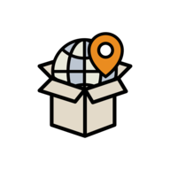

# FavePlace

## Öffentliche Version

Du kannst den Prototypen unter https://fav-place-taxi.peerigon.com anschauen!

## Das Problem, das wir lösen wollen

Aufgrund von Covid-19 und der erhöhten Ansteckungsgefahr wird es auf unabsehbare Zeit nicht mehr möglich sein, die eigenen Lieblingsorte zu besuchen, Ausflüge zu machen oder in den Urlaub zu fahren. Die fehlende Abwechslung führt bei vielen zu Frust und Unausgeglichenheit.

## Die Grundidee hinter der Lösung

Jeder Mensch lebt an einem anderen Ort und hat je nach Ausmaß der Ausgangsbeschränkung einen unterschiedlichen Bewegungsradius. Das nutzen wir: So können wir 360° Panoramen von den unterschiedlichsten Orten in unserer community-basierten WebApp sammeln und wieder zur Verfügung stellen - ganz ohne die Ausgangsbeschränkungen zu verletzen und ohne Ansteckungen zu riskieren.

## Die Erlebnisse für den Nutzer

Die Nutzer in der Community können über eine Weltkarte zu Ihrem Wunschziel springen und sich aktuelle 360° Panoramen ansehen, ohne ihre eigenen vier Wände verlassen zu müssen.
Gibt es noch kein 360° Panorama vom Wunschziel, so kann einfach automatisch eine Anfrage an die Community geschickt werden. Sobald sich dann ein anderer Nutzer in der Nähe dieses Wunschziels anmeldet, wird dieser gebeten, nach Möglichkeit ein 360° Panorama einzureichen. Sobald dies geschehen ist, wird der Nutzer, der sein Wunschziel gesucht hat, benachrichtigt.
Parallel stellen viele andere Nutzer 360° Panoramen für die Community zur Verfügung.
Die Nutzer können dabei ihre Lieblingsorte in einer Favoritenliste speichern - diese kann dann mit anderen auf sozialen Medien geteilt werden oder als Basis für die nächste Urlaubsplanung dienen.

## Die Besonderheiten dieser Lösung

Um die Einstiegshürde so niedrig wie möglich zu machen, ist weder eine Installation einer App noch zwangsweise eine Registrierung erforderlich. Außerdem setzen wir auf das Prinzip, dass Nutzer die eingereichten 360° gegenseitig kontrollieren, um zu verhindern, dass verbotene oder pornografische Inhalte hochgeladen werden.

## Die technische Umsetzung

Auf Basis von Webtechnologien haben wir den ersten Prototypen entwickelt. Die progressive WebApp (TypeScript, React, Node.js) verwendet Google Firebase als Datenbank und Dateispeicher (Bilder, Videos). Dies ermöglicht auch eine einfache und schnelle Synchronisation der User untereinander. Die Karte stammt vom Anbieter Mapbox (Mapbox GL). Die PWA ist auf dem Homescreen der Nutzer installierbar und ermöglicht den direkten Upload der Bilder. Die 360°-Panoramen werden mittels A-Frame sichtbar gemacht, welches direkt die WebVR-API unterstützt und damit auf einer großen Anzahl von mobilen Geräten sehr performante Darstellungen ermöglicht. Durch Drehen und Schwenken des Smartphones können die Bilder interaktiv betrachtet und erkundet werden.

Das ganze Projekt ist "dockerified", kann also via Docker als Container gebaut und deployed werden. Veröffentlicht ist es als Open Source (GPL v3).

Entwickelt wurde es von Anfang an - ohne vorherigen Code - auf GitHub, auch unter der Verwendung von GitHub Actions für CI/CD.

## Der Prototyp hier beim Hackathon

Der Prototyp hier beim Hackathon hat bereits alle Funktionen bis auf die gegenseitige Freigabe der Fotos und die Favoriten hinzufügen.

## Die nächsten Schritte

Wenn wir an dem Projekt weiterarbeiten können, würden wir den Funktionsumfang erweitern und das Nutzungserlebnis verbessern. Außerdem würden wir eine entsprechende Marketingstrategie, sowie ein interaktives Tutorial gestalten.
Selbst nach Covid-19 könnte die Anwendung noch weiter verwendet werden. Sie bietet die einzigartige Möglichkeit, im Gegensatz zu Google Maps, quasi fast in Echtzeit Eindrücke aus der ganzen Welt zu sammeln.

## Wie wir als Team gemeinsam vorgegangen sind

Zunächst haben wir unser Team in zwei Gruppen aufgeteilt, da wir alle sehr unterschiedliche Erfahrungen und Ideen hatten: ein Technik-Team und ein Konzept-Team. Dann haben wir simultan an unseren Projekten gearbeitet. Das Konzept-Team hat sich mit der Umsetzung und Funktion sowie der Gestaltung der App beschäftigt, während das Technik-Team versucht hat, diese Ideen in der App zu verwirklichen. Zwischendurch haben wir in der großen Gruppe kommuniziert, um uns gegenseitig Feedback zu geben und den Stand der jeweilig andere Gruppe zu sehen. Am letzten Tag haben sich dann auch kleinere Gruppen gebildet, die dann an den Illustrationen für das Video, der Aufnahme sowie dem Text gearbeitet haben.

## Was jeder einzelne von uns gelernt hat

Wir haben gelernt, wie viel man mit nur wenig Leuten an einem Wochenende erreichen kann. Am Freitag hätte keiner von uns gedacht, wie weit wir bereits am Sonntag sein würden und auch wie viele weitere Möglichkeiten unser Projekt noch haben kann. Außerdem haben wir gelernt, Aufgaben effizient aufzuteilen und konnten oft die besten Ergebnisse im Gespräch zusammen entwickeln.
